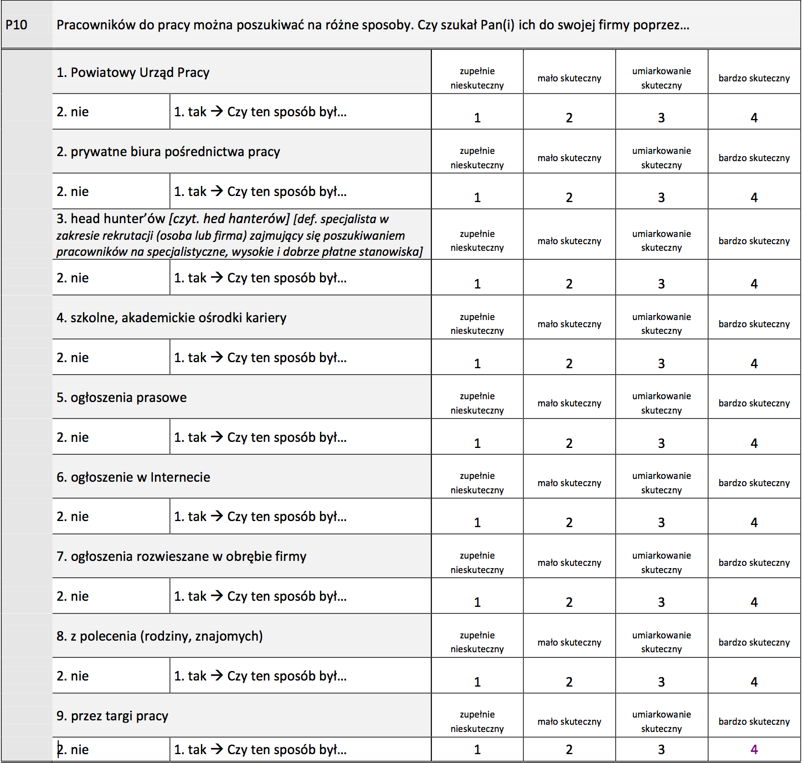

```{r setup, include=FALSE}
knitr::opts_chunk$set(echo = FALSE,
                      cache = T,
                      cache.path = 'cache/')
library(sjPlot)
library(dplyr)
library(broom)
library(knitr)
library(tidyr)
library(ggplot2)
library(lme4)
#library(arules)
#library(arulesViz)
#library(Matrix)
```

```{r read data, include = F}
dane <- haven::read_sav(file = '~/Documents/Uczelnia/Zbiory/BKL/pracodawcy/BKL pracodawcy 1_5ED.sav')
```


## Badanie przedsiębiorców

Opracowane na podstawie raportów ze strony: https://bkl.parp.gov.pl/dane.html

### Informacje o badaniu

#### Populacja

Część badania poświęcona pracodawcom zakładała pozyskanie informacji od podmiotów gospodarczych zatrudniających przynajmniej jednego pracownika i funkcjonujących w momencie przeprowadzania badania terenowego na rynku pracy.

Ze względu na przedmiot badania, którym jest kapitał ludzki, skoncentrowano się na wybranych kategoriach podmiotów. **W efekcie z badanej populacji zostały wyłączone**:

1. Jednostki lokalne.

2. Podmioty z działu 94 działalność organizacji członkowskich według PKD 2007.

3. Podmioty z sekcji:
      + A – rolnictwo, leśnictwo, łowiectwo i rybactwo;
      + O – administracja publiczna i obrona narodowa; obowiązkowe za-
bezpieczenia społeczne;
      + T – gospodarstwa domowe zatrudniające pracowników; gospodar- stwa domowe produkujące wyroby i świadczące usługi na własne potrzeby;
      + U – organizacje i zespoły eksterytorialne.

4. Podmioty, dla których szczególna forma prawna to:
      + 48 – fundacje;
      + 50 – Kościół katolicki;
      + 51 – inne Kościoły i związki wyznaniowe;
      + 55 – stowarzyszenia;
      + 60 – organizacje społeczne oddzielnie niewymienione; 
      + 70 – partie polityczne;
      + 72 – związki zawodowe;
      + 73 – organizacje pracodawców;
      + 76 – samorząd gospodarczy i zawodowy;
      + 85 – wspólnoty mieszkaniowe;
      + 90 – związki grup producentów rolnych.

#### Informacje szczegółowe

+ lata: 2010-2014
+ jednostka badania: podmiot gospodarczy
+ dobór próby: losowy, warstwowy nieproporcjonalny
+ metoda zbierania danych: CATI (99.8%), CAWI (0.2%) dla 2014
+ założona próba: 16 000
+ zrealizowana: 16 013 (w tym 872 największych pracodawców zatrudniających powyżej 250 osób)
+ operat: Spis podmiotów użyty do losowania pochodził z bazy REGON zwery kowanej dzięki użyciu innych dostępnych GUS informacji dotyczących tych podmiotów. Operat ten, podobnie jak inne, obciążony jest błędem ze względu na dezaktualizację części danych (np. kontaktowych) oraz jego zawartości (likwidacja  rm), w szczególności w warstwie przedsiębiorstw najmniejszych. Jak pokazują doświadczenia wcześniejszych edycji badania, skala błędu nie zagraża jednak precyzji wy- ników. Wykonawca badania terenowego (Millward Brown) zadbał również o to, aby błędy te ujawniać i poprawić. Jest to ważne zadanie, ponieważ stopa zwrotów jest większa, jeżeli istnieje możliwość kontaktu z daną  rmą przez cały okres realizacji badania założony w BKL. 


###  Schemat doboru próby

Próba badana składała się z podmiotów pochodzących z próby panelo- wej oraz podmiotów dolosowanych, konstytuujących próbę niepanelową. Łącznie wyjściowe bazy (panelowa oraz niepanelowa) obejmowały 62 822 podmioty. Po zabiegach werykacyjnych w obu bazach ostatecznie znala zło się 52 926 podmiotów.


1. Próba panelowa

Efektywną próbę panelową (12 385) stanowili najwięksi pod względem liczby zatrudnianych pracowników pracodawcy, czyli:

+ wszystkie podmioty zatrudniające 1000 lub więcej pracowników (687 podmiotów);
+ wszystkie podmioty zatrudniające od 250 do 999 pracowników (3 385 podmiotów);
+ wszystkie podmioty zatrudniające od 100 do 249 pracowników (8 313 podmiotów).

2. Próba niepanelowa

Próba niepanelowa dobrana losowo, wraz z próbami rezerwowymi, obję- ła 51 670 podmiotów. Podczas doboru próby niepanelowej wykorzystano warstwowanie nieproporcjonalne, analogiczne do sposobu losowania przeprowadzonego w I, II, III i IV edycji badania. Warstwy stanowiły woje- wództwo oraz liczba zatrudnianych pracowników (1–9 osób, 10–49 osób oraz 50–99 osób). Z jednej strony wylosowano jednakową liczbę pod- miotów dla każdego województwa. Zabieg taki umożliwia porównywal- ność wyników badania na poziomie tych jednostek terytorialnych. Z dru- giej strony zapewniono dobór proporcjonalny do odsetka istniejących w rzeczywistości podmiotów zatrudniających od 10 do 49 pracowników oraz podmiotów zatrudniających od 50 do 99 pracowników. Dwukrotnie zmniejszono, w stosunku do rzeczywistego, odsetek podmiotów zatrud- niających od 1 do 9 pracowników. Taki zabieg zastosowano ze względu na to, że w populacji największe przedsiębiorstwa stanowią niewielką część, zatrudniają jednak większość wszystkich pracowników.

Przed rozpoczęciem realizacji badań oraz już w ich trakcie próba została zwery kowana pod kątem występowania duplikatów oraz samozatrudnie- nia. W wyniku werykacji usunięto z bazy 12 838 podmiotów, które:

+ prowadziły jednoosobową działalność gospodarczą;
+ zostały zlikwidowane lub nie istniały w momencie przeprowadzania badania;
+ występowały w bazie podwójnie (wery kacja na podstawie numeru telefonu oraz numeru REGON).


W konsekwencji zabiegów wery kujących efektywna baza niepanelowa liczyła 38 832 podmioty, w tym:

+ 15 175 podmiotów zatrudniających od 1 do 9 pracowników;
+ 20 916 podmiotów zatrudniających od 10 do 49 pracowników;
+ 2 741 podmiotów zatrudniających od 50 do 99 pracowników.

### Wagi

* województwo i klasa liczby zatrudnionych
* sześć klas PKD

Z uwagi na fakt niemożliwości otrzymania od GUS najbardziej aktualnego operatu, którego poprawność zwery kowana została o dane zewnętrzne, w celu obliczenia wag wykorzystano dane przekazane przez GUS w rok wcześniej (wykorzystane także w IV edycji badania BKL). Operat w takiej formie został powiększony o średnioroczny przyrost liczby przedsiębiorstw netto (około 6,5%) obliczony na podstawie danych GUS przekazywanych na potrzeby BKL od I edycji tego badania.

Na potrzeby szacowania liczby poszukiwanych pracowników przyjęto, że przypadki o ekstremalnej liczbie zadeklarowanych poszukiwanych pra- cowników będą miały wagi populacyjne ustalone na poziomie 1. Jako kry- terium ekstremalności przyjęto górny tzw. „zawias Tukey’a”, czyli wartość równą mniej więcej górnemu kwartylowi powiększonemu o dwukrotność rozstępu ćwiartkowego (jest to dobrze znany w statystyce sposób ustala- nia wartości skrajnych służący m.in. do sporządzania diagnostycznych wy- kresów skrzynkowych czy wykresów łodyga–liście); górny „zawias Tukey’a” obliczono odrębnie dla każdej warstwy przedsiębiorstw pod względem liczby osób zatrudnionych.


## Kwestionariusz

Pełne kwestionariusze dostępne są na stronie: https://bkl.parp.gov.pl/dane.html

Poniżej zamieszczam fragment kwestionariusza dotyczącego ofert pracy, które można by objaśniać.




## Pierwsze wyniki na podstawie bazy danych

### Podstawowe informacje o zbiorze danych


```{r}
dane %>%
  count(edycja) %>%
  kable(.,caption = 'Liczba zbadanych przedsiębiorstw według')
```


```{r}
dane_do_podsumowania <- dane %>%
  select(edycja, PKDkat6, waga_pop_zkorekta, starts_with('p10'))

## poprawiam etykiety
data.table::setattr(dane_do_podsumowania$p10b,
                    'labels',attr(dane_do_podsumowania$p10a,'labels'))
data.table::setattr(dane_do_podsumowania$p10c,
                    'labels',attr(dane_do_podsumowania$p10a,'labels'))
data.table::setattr(dane_do_podsumowania$p10d,
                    'labels',attr(dane_do_podsumowania$p10a,'labels'))
data.table::setattr(dane_do_podsumowania$p10e,
                    'labels',attr(dane_do_podsumowania$p10a,'labels'))
data.table::setattr(dane_do_podsumowania$p10f,
                    'labels',attr(dane_do_podsumowania$p10a,'labels'))
data.table::setattr(dane_do_podsumowania$p10g,
                    'labels',attr(dane_do_podsumowania$p10a,'labels'))
data.table::setattr(dane_do_podsumowania$p10h,
                    'labels',attr(dane_do_podsumowania$p10a,'labels'))
data.table::setattr(dane_do_podsumowania$p10i,
                    'labels',attr(dane_do_podsumowania$p10a,'labels'))
```

Informacja o brakach odpowiedzi

```{r braki odpowiedzi w pytaniach o to gdzie kto publikował, results='asis'}
podsumowanie <- dane_do_podsumowania %>%
  select(matches('p10\\D$')) %>%
  view_df(.,show.labels = T, show.frq = T, 
          show.prc = T, show.na = T,  
          no.output = T, hide.progress = T)
print(cat(podsumowanie$knitr))
```

Odpowiedzi na poszczególne pytania 

```{r}
etyk <- dane_do_podsumowania %>%
  select(matches('p10\\D$')) %>% sapply(.,attr,'label') 

dane_do_podsumowania %>%
  select(edycja, waga_pop_zkorekta, matches('p10\\D$')) %>%
  gather(key = pyt, value = odp, - edycja, -waga_pop_zkorekta) %>%
  count(edycja,pyt,odp, wt = waga_pop_zkorekta) %>%
  group_by(edycja,pyt) %>%
  mutate(p = n/sum(n) * 100) %>%
  select(-n) %>%
  ungroup() %>% 
  mutate(odp = factor(odp,levels = 1:2, labels = c('Tak','Nie')),
         pyt = factor(pyt,levels = unique(pyt),
                      labels = etyk)) %>% 
  na.omit() %>% 
  spread(odp,p) %>%
  arrange(pyt,edycja) %>%
  select(pyt,edycja,Tak, Nie) %>%
  kable(,caption = 'Odpowiedzi według lat')
```


### Prosty model dla zmiennej określającej Internet (p10f)

```{r prosty model, result = 'asis'}
dane_do_modelu <- dane %>%
  select(edycja, p10f, wielkosc, wojewodz, PKDkat6, waga_pop_zkorekta) %>%
  mutate(p10f = p10f == 1,
         wojewodz = factor(x = wojewodz,
                           levels = unique(wojewodz),
                           labels = names(attr(wojewodz,'labels'))),
         wielkosc = factor(x = wielkosc,
                           levels = unique(wielkosc),
                           labels = names(attr(wielkosc,'labels'))[-1]),
         PKDkat6 = factor(x = PKDkat6,
                           levels = unique(PKDkat6),
                           labels = names(attr(PKDkat6,'labels'))[-1]))
  
m1 <- glm(
  formula = p10f ~ edycja + wojewodz + wielkosc*PKDkat6,
  data = dane_do_modelu,
  family = binomial())

texreg::screenreg(m1, single.row = T)
```


```{r}
dane %>%
  select(edycja, p10f, p10a, wielkosc, a6_PKD_21, waga_pop_zkorekta) %>%
  mutate(wielkosc =  factor(x = wielkosc,
                            levels = unique(wielkosc),
                            labels = names(attr(wielkosc, 'labels'))[-1],
                            ordered = T),
         a6_PKD_21 = factor(x = a6_PKD_21,
                            levels = na.omit(sort(unique(a6_PKD_21))),
                            labels = names(attr(a6_PKD_21, 'labels'))[-21])) %>%
  filter(as.numeric(a6_PKD_21) != 20)  %>%
  select(-wielkosc) %>%
  gather(pyt, odp, p10f, p10a) %>%
  count(a6_PKD_21,pyt, odp, wt = waga_pop_zkorekta) %>%
  na.omit() %>%
  group_by(a6_PKD_21,pyt) %>%
  mutate(p = n/sum(n)) %>%
  filter(odp == 1) %>%
  ungroup() %>%
  mutate(a6_PKD_21 = gsub('Sekcja [A-Z]\\s{1,2}\\-','',a6_PKD_21)) %>%
  ggplot(data = .,
         aes(x = a6_PKD_21,
             y = p,
             group = pyt,
             fill = pyt)) +
  geom_col(position = position_dodge(width = 0.9),
           col = 'black') +
  coord_flip() +
  theme_bw() + 
  scale_fill_brewer(name = 'Miejsce',
                    palette = 'Set1',
                    breaks = c('p10a','p10f'),
                    labels = c('PUP','Internet')) +
  labs(y = 'Odsetek', x = 'Sekcja')  + 
  scale_y_continuous(labels = scales::percent) +
  theme(text = element_text(size = 15)) -> p

ggsave(filename = 'sekcja-zrodla.png', plot = p, width = 14)  
```

```{r}
model1 <- glmer(formula = p10f == 1 ~ trend + (1|a6_PKD_21) + (1|wielkosc/a6_PKD_21) +  
                  (1|wojewodz) + (1 | REGON),
                data = na.omit(dane %>% select(trend, a6_PKD_21, wielkosc, wojewodz, REGON, p10f, p10a)),
                family = binomial(),
                nAGQ = 0,
                glmerControl(optimizer = "nloptwrap", calc.derivs = FALSE))

summary(model1)


model2 <- glmer(formula = p10a == 1 ~ trend + (1|a6_PKD_21) + (1|wielkosc/a6_PKD_21) +  
                  (1|wojewodz) + (1 | REGON ),
                data = na.omit(dane %>% select(trend, a6_PKD_21, wielkosc, wojewodz, REGON, p10f, p10a)),
                family = binomial(),
                nAGQ = 0,
                glmerControl(optimizer = "nloptwrap", calc.derivs = FALSE))

summary(model2)

sjt.glmer(model1, model2, depvar.labels = c('Internet','PUP'), show.r2 = TRUE, show.hoslem = T)


```

```{r}
dane %>%
  select(edycja, p10f, p10a, wielkosc, a6_PKD_21) %>%
  mutate(wielkosc =  factor(x = wielkosc,
                            levels = unique(wielkosc),
                            labels = names(attr(wielkosc, 'labels'))[-1],
                            ordered = T),
         a6_PKD_21 = factor(x = a6_PKD_21,
                            levels = na.omit(sort(unique(a6_PKD_21))),
                            labels = names(attr(a6_PKD_21, 'labels'))[-21])) %>%
  filter(as.numeric(a6_PKD_21) != 20)  %>%
  select(-wielkosc) %>%
  gather(pyt, odp, p10f, p10a) %>%
  count(a6_PKD_21,pyt, odp) %>%
  na.omit() %>%
  group_by(a6_PKD_21,pyt) %>%
  mutate(p = n/sum(n)) %>%
  filter(odp == 1) %>%
  ungroup() %>%
  mutate(a6_PKD_21 = gsub('Sekcja [A-Z]\\s{1,2}\\-','',a6_PKD_21)) %>%
  ggplot(data = .,
         aes(x = a6_PKD_21,
             y = p,
             group = pyt,
             fill = pyt)) +
  geom_col(position = position_dodge(width = 0.9),
           col = 'black') +
  coord_flip() +
  theme_bw() + 
  scale_fill_brewer(name = 'Miejsce',
                    palette = 'Set1',
                    breaks = c('p10a','p10f'),
                    labels = c('PUP','Internet')) +
  labs(y = 'Odsetek', x = 'Sekcja')  + 
  scale_y_continuous(labels = scales::percent) +
  theme(text = element_text(size = 15)) -> p2

ggsave(filename = 'sekcja-zrodla-bez-wagi.png', plot = p2, width = 14)  
```

```{r}
dane_do_podsumowania %>%
  select(edycja, waga_pop_zkorekta, matches('p10\\D$')) %>%
  gather(key = pyt, value = odp, - edycja, -waga_pop_zkorekta) %>%
  count(edycja,pyt,odp, wt = waga_pop_zkorekta) %>%
  group_by(edycja,pyt) %>%
  mutate(p = n/sum(n) * 100) %>%
  select(-n) %>%
  ungroup() %>% 
  mutate(odp = factor(odp,levels = 1:2, labels = c('Tak','Nie')),
         pyt = factor(pyt,levels = unique(pyt),
                      labels = etyk)) %>% 
  na.omit() %>%
  filter(odp == 'Tak') %>%
  mutate(pyt = gsub('Czy szukano pracowników przez ','',pyt)) %>%
  ggplot(data = .,
         aes(x = edycja,
             y = p,
             group = pyt,
             color = pyt)) +
  geom_line(size = 2) + 
  geom_point(size = 2) + 
  theme_bw() +
  scale_color_brewer(palette = 'Set1', name = 'Czy szukano pracowników przez...') +
  labs(x = 'Edycja', y = 'Odsetek [%]')
  
```

```{r}
dane_do_podsumowania %>%
  select(PKDkat6, p10a, p10b, p10c, p10d, p10e, p10f, p10g, p10h, p10i, waga_pop_zkorekta) %>%
  na.omit() %>%
  gather(key = pyt, value = odp, -PKDkat6, -waga_pop_zkorekta) %>%
  count(PKDkat6, pyt, odp, wt = waga_pop_zkorekta) %>%
  filter(odp == 1) %>%
  group_by(pyt) %>%
  mutate(p = n/sum(n)) %>%
  ggplot(data =.,
         aes(x = pyt,
             y = p,
             fill = factor(PKDkat6))) +
  geom_col(col = 'black') -> p

plotly::ggplotly(p)
```
```{r}
dane_do_podsumowania %>%
  select(PKDkat6, p10a, p10b, p10c, p10d, p10e, p10f, p10g, p10h, p10i, waga_pop_zkorekta) %>%
  na.omit() %>%
  gather(key = pyt, value = odp, -PKDkat6, -waga_pop_zkorekta) %>%
  count(PKDkat6, pyt, odp, wt = waga_pop_zkorekta) %>%
  xtabs(n~PKDkat6+odp+pyt, data = .) 
```

